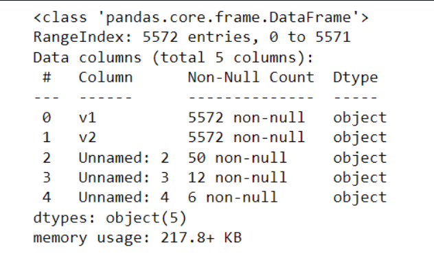
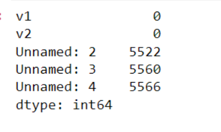

# Implementation-of-SVM-For-Spam-Mail-Detection

## AIM:
To write a program to implement the SVM For Spam Mail Detection.

## Equipments Required:
1. Hardware – PCs
2. Anaconda – Python 3.7 Installation / Moodle-Code Runner

## Algorithm
1. Import the necessary packages.
2. Read the given csv file and display the few contents of the data.
3. Assign the features for x and y respectively.
4. Split the x and y sets into train and test sets.
5. Convert the Alphabetical data to numeric using CountVectorizer.
6. Predict the number of spam in the data using SVC (C-Support Vector Classification) method of SVM (Support vector machine) in sklearn library.
7. Find the accuracy of the model.

## Program:
```
/*
Program to implement the SVM For Spam Mail Detection..
Developed by: Aakash S
RegisterNumber:  212221240001
*/
import pandas as pd
import matplotlib.pyplot as plt
data=pd.read_csv("spam.csv",encoding='latin-1')
data.head()
data.info()
data.isnull().sum()
x=data["v1"].values
y=data["v2"].values
from sklearn.model_selection import train_test_split
x_train,x_test,y_train,y_test=train_test_split(x,y,test_size=0.2,random_state=0)
from sklearn.feature_extraction.text import CountVectorizer #CountVectorizer is a method to convert textt to neumerical data.the text is transformed to a sparse matrix
cv=CountVectorizer()
x_train=cv.fit_transform(x_train)
x_test=cv.transform(x_test)
from sklearn.svm import SVC
svc=SVC()
svc.fit(x_train,y_train)
y_pred = svc.predict(x_test)
y_pred
from sklearn import metrics
accuracy= metrics.accuracy_score(y_test,y_pred)
accuracy
```

## Output:
### Dataset:

### Dataset information:

### Data null:

### Detected spam:

### Accuracy score of the model:


## Result:
Thus the program to implement the SVM For Spam Mail Detection is written and verified using python programming.
